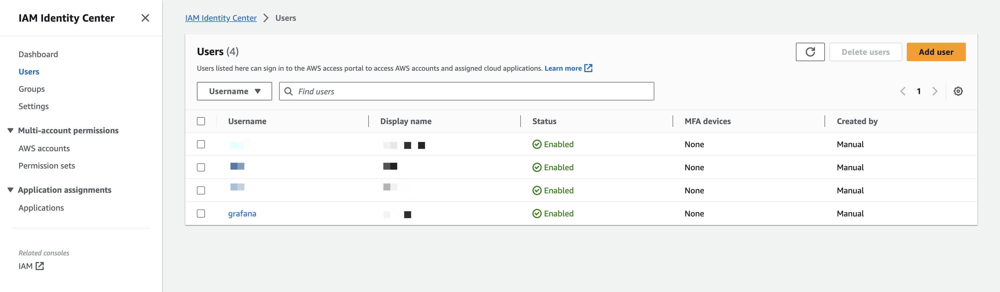
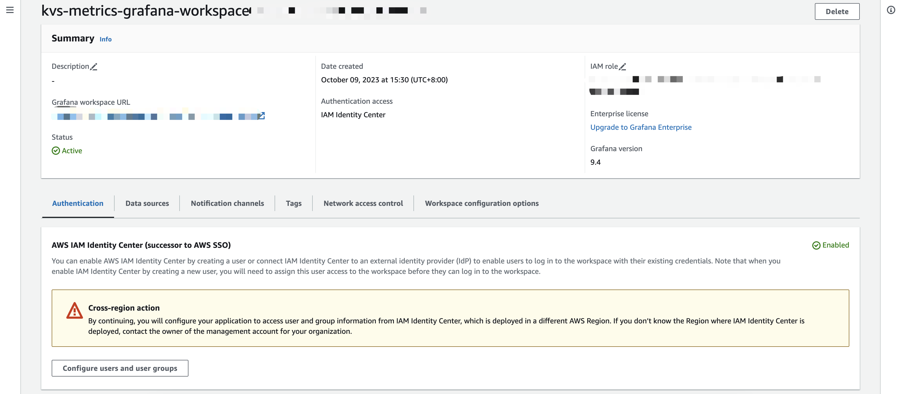
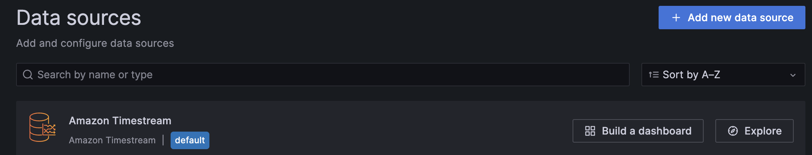
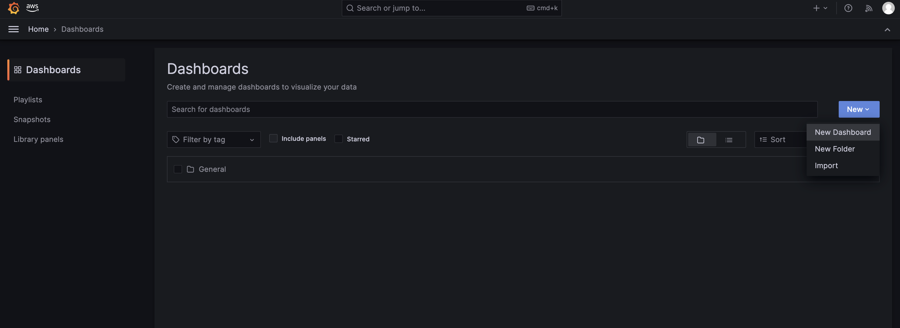
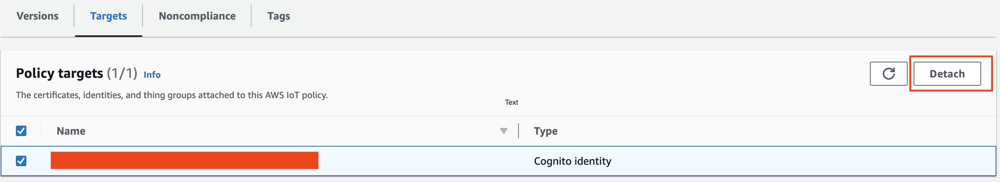

# Running CDK Sample

The easiest way to test Mobile App kvs webrtc optimizations is to deploy it using the AWS Development Kit provided by this project. Once you have launched the CloudFormation stack, you will get a fully working demo related backend resources hosted in your account.

## Getting Started

### Prerequisite
- npm
  - Last validated version: 8.15.0
- bash
  - Last validated version: GNU bash, version 5.2.15(1)-release (x86_64-apple-darwin22.1.0)
- JDK 11
- Maven
  - [https://maven.apache.org/install.html](https://maven.apache.org/install.html)
  - Last validated version: Apache Maven 3.8.6
- AWS CDK
  - `npm install -g aws-cdk@latest`
- AWS CLI
  - [Install or update the latest version of the AWS CLI](https://docs.aws.amazon.com/cli/latest/userguide/getting-started-install.html#cliv2-linux-install)

### Setup environment variables for AWS CDK

#### Option 1: Configure AWS CLI
```
aws configure
```

#### Option 2: Export Environment Variable
```
export AWS_ACCESS_KEY_ID=XXX
export AWS_SECRET_ACCESS_KEY=XXX
export AWS_ACCOUNT_ID=123456789012
export AWS_REGION=us-east-1
```

### Deployment

Run cdk deploy to synthesize and deploy the cloud backend.
```
cd CDK/
cdk deploy
```
Command above will deploy CDK stack to AWS account.

### Setting up Amazon Grafana Workspace
This solution allows you to manage a real-time telemetry dashboard with KVS WebRTC metrics and Grafana on your browser.

1. Create user in IAM Identity Center.



2. Enter Amazon Grafana Workspace, under **Authentication** tab, in **AWS IAM Identity Center (successor to AWS SSO)** section click **Configure new user or group**.



By default, the user is assigned to **viewer** role. You should have to assign the user to **admin** role.

### Creating the Dashboard

The Grafana portal is created and you are logged in. We will create the dashboard in this section.
1. Select **Administration** -> **Data sources** from left panel
2. Click into default data source **Amazon Timestream**, configure the Timestream data source;

- Authentication Provider: `Workspace IAM Role`
- Default Region: Select the region you deployed
- Database: `kvs-metrics-timestream-db-*`
- Table: `kvs-metrics-timestream-db-table-*`
- Measure: `API`



3. Select **Dashboards** from left panel, click on **New** and choose **Import**. Upload the file [KVS-WebRTC-Metrics.json](./asset/grafana/KVS-WebRTC-Metrics.json)



## Cleanup

1. Detach all targets in IoT policy with the prefix `kvs-metrics-mobile-registration-policy-`



2. Delete all resources run the following command in this directory
```
cdk destroy
```
