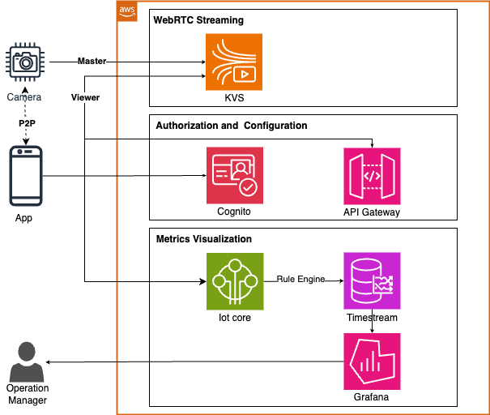
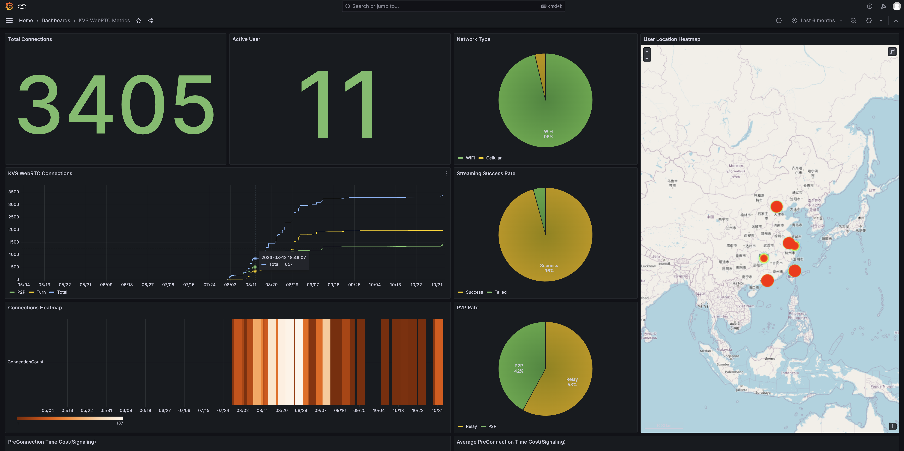

Amazon Kinesis Video Stream WebRTC Optimization Sample for Android
=============================================
This is an example Android application of Amazon KVS(Kinesis Video Stream) WebRTC. It demonstrates how to shorten the WebRTC pre-connection time and peer to peer (viewer to master) connection time. There are two parts included:
1. An Android application including optimizations for Amazon KVS WebRTC viewer.
2. A visualization of Amazon KVS WebRTC timing metrics.

## Architecture Overview

The following diagram shows an overview of the system architecture.

## Deploy KVS WebRTC metrics resources

To test the android application optimization, a tool can be deployed to collect KVS WebRTC metrics. Refer to [README](./CDK/README.md) file to deploy this tool with [AWS CloudFormation](https://aws.amazon.com/cloudformation/).

## Build and Run Android App

This project offers android application optimizations along with a script to facilitate the process of downloading optimizations source code. Refer to [README](./MobileApp/README.md) file to build and run this sample app.

## Track KVS WebRTC metrics
After you complete the procedure above, you can proceed to track Amazon KVS WebRTC timing metrics by completing the following steps.

### Setup master
1. Download, build, and run the [WebRTC SDK in C for Embedded Devices](https://docs.aws.amazon.com/kinesisvideostreams-webrtc-dg/latest/devguide/kvswebrtc-sdk-c.html) in master mode on a camera device.
	- It is recommended to get started with [out-of-box KVS WebRTC sample](https://github.com/aws-samples/amazon-kinesis-video-streams-media-interface#getting-started-with-out-of-box-kvs-webrtc-sample).
2. Or get started with [KVS WebRTC Test Page](https://awslabs.github.io/amazon-kinesis-video-streams-webrtc-sdk-js/examples/index.html) that you can use to create a new or connect to an existing signaling channel and use it as a master.

Before starting master, specify the following information that you want to use for this demo.
- AWS Region
- The access key and the secret key of the AWS account that you want to use.
- The name of the signaling channel to which you want to connect.
- Must choose Send Vedio.
* **Note:** Ensure that you specify the same signaling channel name, AWS region, the access key and the secret key on 
both master and viewer client that you're using.

### Setup viewer
1. Run the sample Android app in simulator or in Android device.
2. On your Android device, open WebRTC TTFF app and sign up by creating a new account or sign in with existing accounts.
* **Note:** This account information is stored in your Cognito User Pool and is not your AWS Console user name/password.

### Verify peer to peer streaming
Verify peer to peer streaming between a master and Android device as viewer by completing the following steps.
1. Start [KVS WebRTC Test Page](https://awslabs.github.io/amazon-kinesis-video-streams-webrtc-sdk-js/examples/index.html) or [WebRTC SDK in C for Embedded Devices](https://docs.aws.amazon.com/kinesisvideostreams-webrtc-dg/latest/devguide/kvswebrtc-sdk-c.html) as a master.
2. Click "Start webrtc" button in the Android device as a viewer.
3. Verify media showing up from the master to the Android.

### Track viewer metrics in Grafana dashboard
1. Click "Stop webrtc" button to stop viewing and upload metrics.
2. Sign in Grafana dashboard to view collected WebRTC metrics.

## Security

See [CONTRIBUTING](CONTRIBUTING.md#security-issue-notifications) for more information.

## License

This project is licensed under the [MIT-0 License](https://spdx.org/licenses/MIT-0.html). See [LICENSE](LICENSE) for more information.

## Legal

During the launch of this project, you will install software (and dependencies) on the AWS Lambda launched in your account or on your deploy environment via stack creation.
The software packages and/or sources you will install will be from the third party sites.
Below is the list of such third party software, the source link, and the license link for each software.
Please review and decide your comfort with installing these before continuing.

* aws-cdk
	* Source: https://github.com/aws/aws-cdk
	* License: https://github.com/aws/aws-cdk/blob/main/LICENSE
* boto3
	* Source: https://github.com/boto/boto3
	* License: https://github.com/boto/boto3/blob/master/LICENSE
* androidx
	* Source: https://github.com/androidx/androidx
	* License: https://github.com/androidx/androidx/blob/androidx-main/LICENSE.txt
* material
	* Source: https://github.com/material-components/material-components-android
	* License: https://github.com/material-components/material-components-android/blob/master/LICENSE
* gson
	* Source: https://github.com/google/gson
	* License: https://github.com/google/gson/blob/master/LICENSE
* amplifyframework
	* Source: https://github.com/aws-amplify/amplify-android
	* License: https://github.com/aws-amplify/amplify-android/blob/main/LICENSE
* jsbridge
	* Source: https://github.com/lzyzsd/JsBridge
	* License: https://github.com/lzyzsd/JsBridge/blob/master/README.md
* aws-iot-device-sdk-js-v2
	* Source: https://github.com/aws/aws-iot-device-sdk-js-v2
	* License: https://github.com/aws/aws-iot-device-sdk-js-v2/blob/main/README.md
* amazon-kinesis-video-streams-webrtc-sdk-js
	* Source: https://github.com/awslabs/amazon-kinesis-video-streams-webrtc-sdk-js
	* License: https://github.com/awslabs/amazon-kinesis-video-streams-webrtc-sdk-js/blob/master/LICENSE.txt